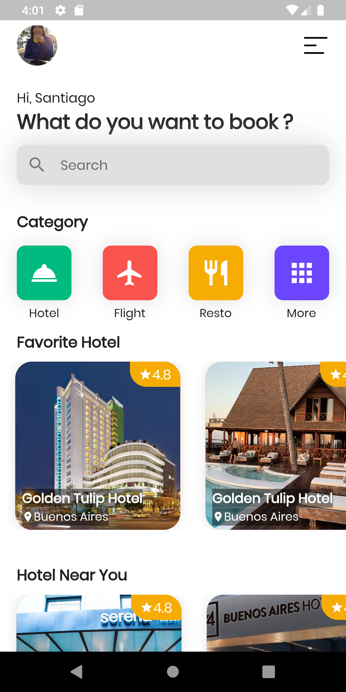
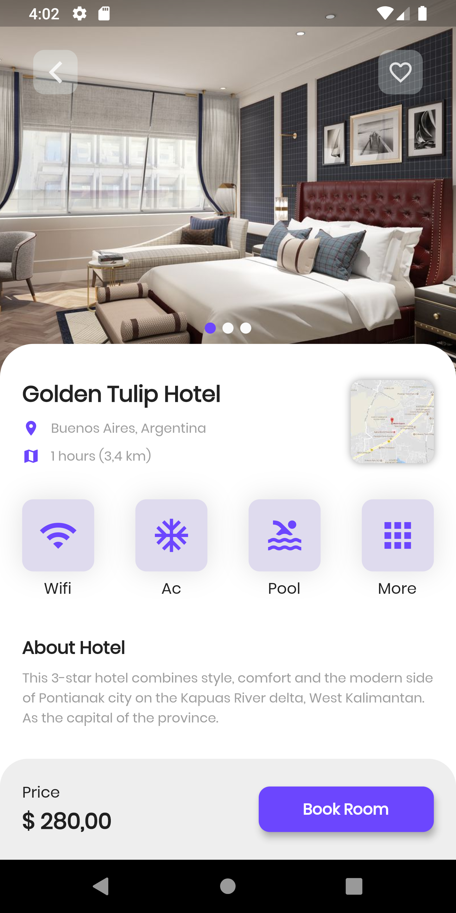

# Hotel UI
 Aplicación mobile multiplataforma desarrollada en Flutter. 
 
# Getting Started
 Para instalar el proyecto se debe ejecutar el siguiente comando en la carpeta raíz del proyecto
 ```
  flutter packages get
```
# Screenshots
El diseño fue inspirado en el siguiente UI. Créditos del diseño a [Andika Wiraputra](https://dribbble.com/AndikaWP/about)


# Resultado

 
